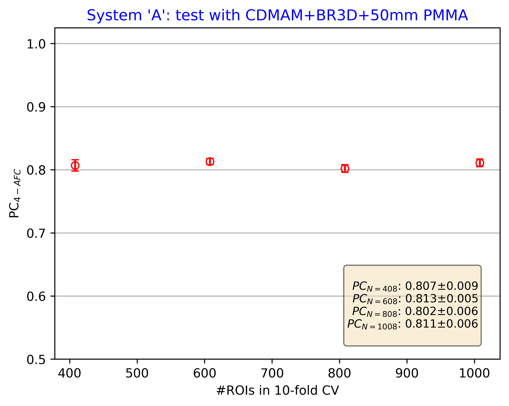

# CDMAM-4.0-DLMO-research-science-tool
This RST contains a set of Python scripts for extracting and analyzing CDMAM 4.0 ROIs to evaluate DBT system image quality using DL-based observer. For this a pre-trained deep learning model (Keras API) is used as a starting point for fine-tuning a *new* observer model with images collected using the subject device. The software evaluates DBT performance in terms of 4-AFC proportion correct (PC) score through cross-validation. The starting *baseline* [model](https://plaque.twinbrook.org/index.php/s/QqtXn25qpP7MstE) was trained by the FDA using approximately 80,000 CDMAM 4.0 ROIs and includes images from several major DBT manufacturers, collected with assistance from the AdvaMed association. It represents a variety of DBT systems with different x-ray detector types, spectra, spatial resolution, reconstruction algorithms, post-processing, scanning geometries, etc., and has a good knowledge of what CDMAM signals look like in reconstructed DBT slices with non-uniform "swirl" background.
A series of DICOM DBT reconstruction volumes of the (CDMAM 4.0 + BR3D "swirl" background + PMMA) phantom assembly is used as an input to produce PC score and its standard error of the mean (SEM) as a measure of system performance. There are three major steps involved: 1) data acquisition (described in [data collection manual PDF](https://plaque.twinbrook.org/index.php/s/AZYWP2z9SBYyexd), 2) ROI extraction (manual or automated), and 3) fine-tuning/cross-validation for image quality perfomance assessment. Provided below are examples of how to execute the above tasks.
# ROI extraction
Assuming that imaging  data has been collected (18 DBT scans of the CDMAM assembly per given PMMA thickness) the user can proceed with generating image crops for cross-validation. To run the ROI extraction script in **manual** mode (with CDMAM 4.0 grid outer vertex (*x,y*)-coordinates as determined visually in ImageJ) use:
```bash
python3 extract_cdmam_rois.py -ctr_slc 24 <path_to_dicom_files> -m "(x_A, y_A, x_B, y_B, x_C, y_C, x_D, y_D)"
```
where `ctr_slc` is the DBT plane in focus with numbering starting from zero, `(x_A, y_A, x_B, y_B, x_C, y_C, x_D, y_D)` are the CDMAM 4.0 grid outer rectangle corner coordinates in pixels. This method can be used if data collection (for given PMMA thickness ) was done with CDMAM phantom position *unchanged* between DBT scans. [Sample dataset](https://plaque.twinbrook.org/index.php/s/ssb8YS4NzC6LWMt) DICOM files for testing this mode can be used with `"(396, 493, 1713, 499, 388, 2345, 1705, 2352)"` set of corner coordinates.
If the CDMAM position was accidently altered between scans the user has an option to either apply the script in manual mode, providing new (A, B, C, D) coordinates of the CDMAM grid corners for each scan when position was changed, or run the script in **automatic** mode, in which the computer vision (CV2) `SimpleBlobDetector` algorithm will need to be tuned to find the fiducial markers in the CDMAM image. This process is explained in the ROI extraction manual [PDF](https://plaque.twinbrook.org/index.php/s/ABCD). Note that in this mode the main script uses `detect_blobs.py` module which should be located in the same folder as `extract_cdmam_rois.py`. To run the ROI extraction script in **automatic** mode use:
```bash
python3 extract_cdmam_rois.py -ctr_slc 24 <path_to_dicom_files> -a
```
We recommend to always visually inspect extracted ROI crops in ImageJ by loading all `roi_*.png` files into ImageJ `File -> ImageSequence` stack before proceeding with cross-validation. Good quality patches may have some CDMAM 4.0 cell-separating lines visible at the squares borders, but no more than a few (2-4) pixels deep into an ROI. No symbols or characters in the CDMAM should be present in the ROIs. Square ROIs have two zero-valued lines drawn by the software to separate them into four qudrants. The central CDMAM detail (signal) should be approximately at the intersection of these lines, while the eccentrtic detail should be in one of the four quadrants. Note that due to presence of the non-uniform background some lower contrast details may be hard to see.

# Fine-tuning and cross validation with new data
Imaging performance evaluation is done by performing 10-fold cross-validation runs on a new data. To start cross-validation script use:
```bash
python3 run_cv.py -m <baseline_model> -d <test_dataset_path>
```
where `<baseline_model>` is the pre-trained [CDMAM] Keras model supplied with this RST, for instance `/home/makeev/cdmam_dlmo/cdmam_advamed.keras`, `<test_dataset_path>` is a full path to where test ROI (`roi_*.png`) files are located. Note that `run_cv.py` calls the `test_cdmam_model.py` module, which should be located in the same directory as `run_cv.py`. The output of this step will be a text file named like
`cv_results__2025-01-10_19-36-54_*.txt` with PC values as computed from cross-validation. A user is free to edit `f_res_name` variable in the `run_cv.py` source file to reflect what is being tested (maybe by adding a system name, PMMA thickness, and so on). With recommended 18 scans (per given PMMA thickness) one will supply 18x56= 1,008 ROI samples for cross-validation. In order to see if the new observer model reaches *saturation* (state when PC does not improve significantly with more data) the process is repeated with progressively fewer number of ROIs used in cross-validation, by randomly removing 200 images three more times, e.g. calculating PC with 808, 608, and 408 samples. A `temp` folder is created in the `<test_dataset_path>` to temporarily store removed files. In the end there are four N_ROI points for which system performance is calculated.  In order to average effects of random splits and random mini-batches 10-fold cross-validation is repeated four times for each N_ROI. The final mean PC value and its SEM are calculated from 40 cross-validation folds and reported as the device’s performance metric. Typical output of the `run_cv.py` should look like shown below:
```bash
CV using 1008 ROIs
0.792 0.842 0.812 0.832 0.802 0.782 0.832 0.792 0.840 0.800
0.861 0.822 0.812 0.822 0.792 0.832 0.802 0.762 0.800 0.840
0.812 0.762 0.851 0.802 0.802 0.812 0.792 0.802 0.790 0.880
0.802 0.832 0.752 0.792 0.842 0.772 0.782 0.832 0.840 0.880
CV using 808 ROIs
0.790 0.815 0.877 0.877 0.802 0.815 0.840 0.827 0.713 0.738
0.790 0.815 0.827 0.728 0.840 0.815 0.802 0.765 0.812 0.838
0.815 0.827 0.802 0.802 0.877 0.815 0.753 0.815 0.738 0.787
0.778 0.877 0.827 0.827 0.864 0.802 0.827 0.716 0.762 0.838
CV using 608 ROIs
0.754 0.836 0.820 0.852 0.820 0.721 0.852 0.820 0.767 0.767
0.787 0.787 0.836 0.787 0.820 0.836 0.770 0.770 0.733 0.750
0.836 0.787 0.836 0.852 0.787 0.803 0.869 0.902 0.817 0.800
0.885 0.869 0.836 0.770 0.836 0.754 0.787 0.836 0.800 0.850
CV using 408 ROIs
0.829 0.878 0.902 0.756 0.854 0.805 0.780 0.805 0.875 0.725
0.805 0.854 0.780 0.878 0.780 0.805 0.829 0.780 0.725 0.900
0.805 0.756 0.829 0.780 0.829 0.829 0.707 0.780 0.900 0.875
0.780 0.805 0.854 0.756 0.780 0.780 0.780 0.756 0.775 0.900
```
# Creating PC vs. N_ROI graph for summary performance report
The output data above can be visualized and saved on disk by executing:
```bash
python3 plot_pc_vs_nroi.py -f <cv_results_file.txt> -o <output_png_filename>
```
DBT device performance (4-AFC PC score with SEM error bars) as a
function of number of images used in cross-validation will be
summarized as shown in the graph below.


For FDA regulatory submissions we ask the vendors to conduct three such
tests with varied thicknesses of added PMMA (20, 40 and 50 mm) simulating
different breast thickness for predicate and subject devices.
